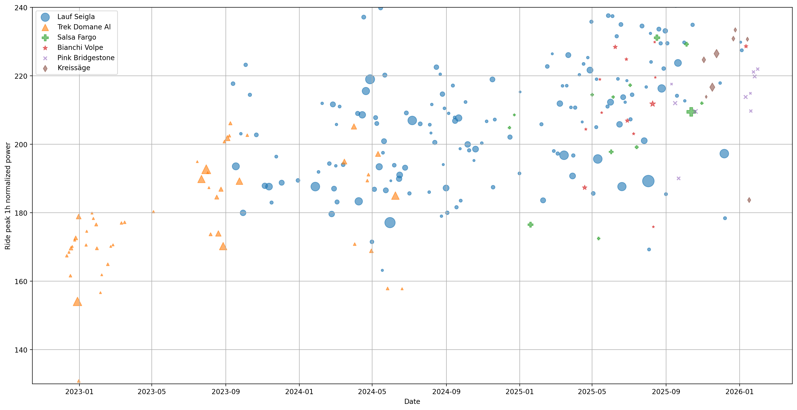
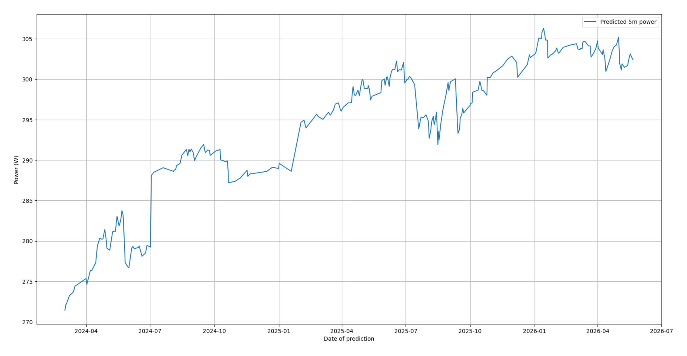

# Strava History Analysis

This is a hobby project that I am using to analyze my cycling data in a more granular manner than Strava (or other applications like Intervals.icu allow).

1. Run complex queries over my historical activities: while I can easily see the metrics I care about for each activity individually on Strava, I would like to able to work with the entire dataset as whole, and analyze it in a systematic manner.
2. Build a simple power pacing calculator for my really long rides, especially if the rides are longer than anything I've done in the past (details on that below). 

## How to use, and examples

Detailed instructions on how to do steps 1 and 2 are listed below, but at a high level, this is what a new user will need to do to set this up for themselves.

1. Set up the strava client (needs creation of a Strava application on the user side, and downloading some secret tokens).
2. Download a dump of historical Strava data: this is necessary since the API is rate limited, and place it in the `fit_files/` directory at the project root.
3. Once the above two steps are done, the `get_spine` function to `database.py` will do the rest of the work, namely pulling in new activities, populating the cache, etc.
4. With the main spine populated, the user can write their custom analysis functions that compute scalar values they care about from each activity, e.g. Normalized power, peak 1h normalized power, Power/HR drift, etc. The notebooks in the `notebooks/` directory have a few examples of these.

As an example, here's a chart of my peak 1H normalized power over the last few years, grouped by the bike I did the ride on (the size of the dot indicates the ride length).



And here's an example of how my rudimentary pacing model think my peak 5m power has evolved over time: in paricular, it's using maximal efforts on other durations to estimate this for rides where I may not have been necessarily targeting a 5m power PR.




## Pacing calculator

The key idea here is to maintain an internal power-duration curve that is constantly updating, across the time axis
as I collect more and more ride data. It should also update the historical data points to account for any change in fitness
over time.

I'm planning on using a fairly simple functional form for the power curve, and I will fit the params off of my data.
The key requirement I have from this model is that it does well in the 6hr+ regime, since I'm mostly interested in doing
ultras. Once I do some multi-day events, I might have to change to model to account for that as well.

```
P(t) = A / (t + τ) + B * t^(-α)
```
### Parameters

- **A** (joules): Anaerobic work capacity contribution
- **τ** (seconds): Time constant that prevents singularity at t=0 and shapes short-duration behavior
- **B** (watts × seconds^α): Scaling factor for the aerobic/endurance component
- **α** (dimensionless): Decay exponent, typically 0.05-0.10

## Detailed setup instructions (written by Claude, and human verified and edited)

### 1. Prerequisites and install

- Python 3.11 or later
- [`uv`](https://docs.astral.sh/uv/) for dependency management

After cloning, install dependencies:

```bash
uv sync
```

### 2. Create a Strava API application

You need your own Strava API credentials to pull activities incrementally.

1. Go to https://www.strava.com/settings/api
2. Create an application — any name works; set the **Authorization Callback Domain** to `localhost`.
3. From the resulting app page, copy the **Client ID** and **Client Secret** — you'll need both in step 3.

When you do the OAuth flow in step 4, make sure to request the `activity:read_all` scope so historical activities (and private ones) are visible to the client.

### 3. Populate the `secrets/` directory

The code expects two JSON files at the project root:

```
secrets/authentication.json
secrets/token.json
```

`secrets/authentication.json` holds your app credentials:

```json
{
  "client_id": "12345",
  "client_secret": "abc123..."
}
```

`secrets/token.json` holds the OAuth tokens. You'll create this in the next step, but the shape is:

```json
{
  "access_token": "...",
  "refresh_token": "...",
  "expires_at": 1234567890
}
```

`initialize_client` in `stravalib_wrapper.py` auto-refreshes this file when the access token expires.

### 4. Bootstrap OAuth (first-time only)

There is no helper script yet — you'll need to manually exchange an authorization code for tokens once. From a Python shell (`uv run python`):

```python
from stravalib import Client
import json

CLIENT_ID = "..."     # from secrets/authentication.json
CLIENT_SECRET = "..."

client = Client()
url = client.authorization_url(
    client_id=CLIENT_ID,
    redirect_uri="http://localhost",
    scope=["activity:read_all"],
)
print(url)
# Open the URL in a browser, authorize, and copy the `code` query parameter
# from the localhost redirect URL (the page itself will fail to load — that's fine).

code = "paste_the_code_here"
token = client.exchange_code_for_token(
    client_id=CLIENT_ID,
    client_secret=CLIENT_SECRET,
    code=code,
)

with open("secrets/token.json", "w") as f:
    json.dump(token, f)
```

After this, `initialize_client` handles all future refreshes automatically.

### 5. Download your Strava bulk export

The Strava API is rate-limited, so historical data is bootstrapped from the bulk export rather than the API.

1. In Strava, go to **Settings → My Account → "Download or Delete Your Account" → Download**. (The export lives on the deletion page — clicking this does not delete anything.)
2. Wait for the email — anywhere from a few hours to a couple of days.
3. Unzip the archive so that the layout under `fit_files/` is:

   ```
   fit_files/activities.csv
   fit_files/activities/<id>.fit       (or .fit.gz)
   ```

Note: `initialize_db_from_strava_dump` filters to `.fit` activities only, so older (pre 2018 activities) `.gpx`/`.tcx` uploads will not be ingested.

### 6. Required directories

These are gitignored, so a fresh clone is missing them. Create them up front (some only need to exist as empty directories):

```
secrets/                          # see steps 3-4
fit_files/                        # from the bulk export
fit_files/activities/             # from the bulk export
fit_files/api_series_pulls/       # created by the code; parent must exist
database/                         # spine.parquet lives here
cache/                            # parsed time-series parquet cache
```

Once all of the above is in place, open any of the marimo notebooks under `notebooks/` with `uv run marimo edit notebooks/<file>.py` and call `get_spine(root_path="./", poll_strava=True)` to populate the spine for the first time.